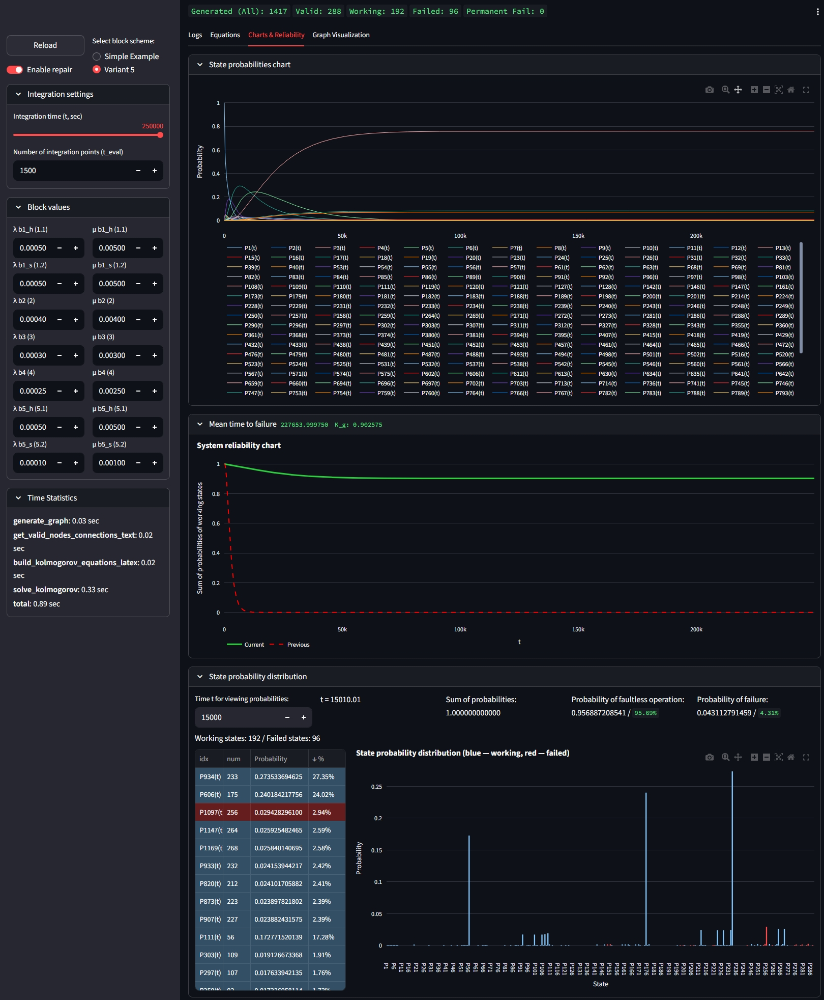
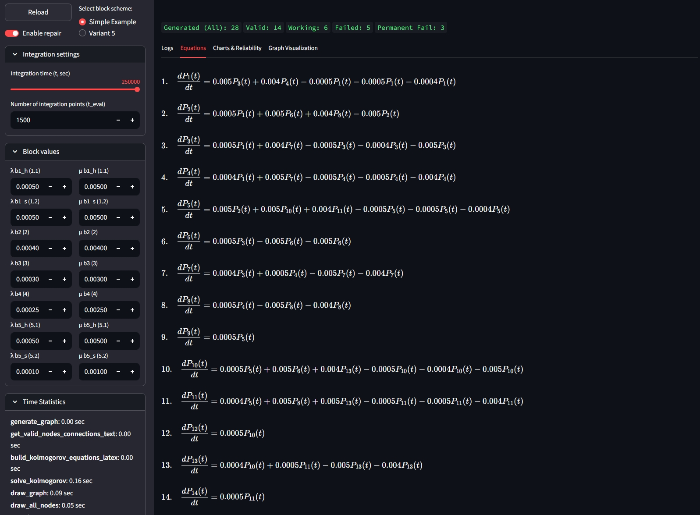
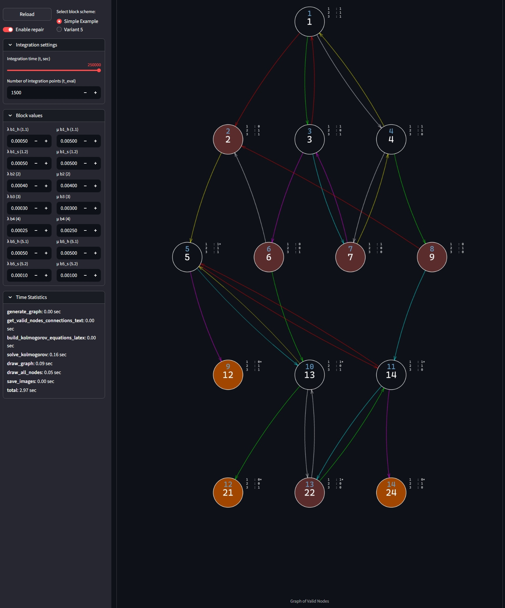

# tnps_labs

This program is designed for modeling and analyzing the reliability of complex systems with repair capabilities. It allows you to set block parameters, integration settings, view Kolmogorov equations, state graphs, and obtain system operation statistics.

## Main Features

- Selection of block schemes
- Configuration of failure and repair parameters
- Visualization of the system state graph
- Construction of Kolmogorov equations
- Charts of state probabilities and reliability
- Statistics of operation and failure times

## Installation and Launch

1. **Install required libraries**  
   Run the following command in your terminal to install all dependencies:
   ```
   pip install -r requirements.txt
   ```

2. **Launch the application**  
   You can run any Streamlit file directly:
   ```
   streamlit run <your_file.py>
   ```

## Screenshots

### Main screen: state probabilities and reliability charts



### Kolmogorov equations screen



### State graph visualization



